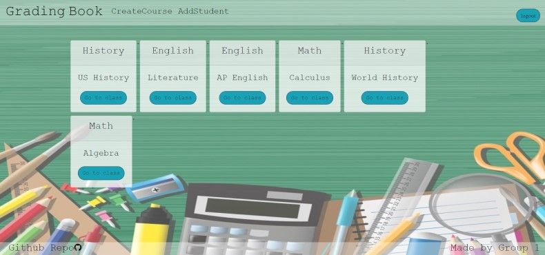
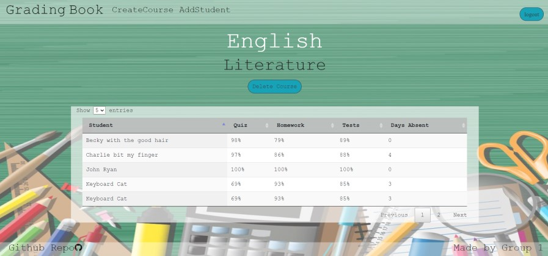

<h1 align="center">Teachers Grading Book</h1>

<p align="center">


</p>

<p align="center">
    
</p>


## Table of Contents
- [Description](#description)
- [Installation](#install)
- [Usage](#usage)
- [Questions](#questions)
- [License](#license)

## Description
### Grading Book will be a web-based application that is intuitive and easy to use. It will provide the teacher with a secure place to store grades that can be accessed from home or mobile. Giving the teacher the ablilty to edit student grades, roster, and classes.


## Install
```
npm init

```

## Usage
### In the terminal Run  
```
npm start

http://localhost:3001/
```

## Below is a link to the GitHub repository   
[Teacher Grade Book](https://github.com/mattkohl82/Teachers-Grading-Book.git)    

### Heroku deployment page 
[Teacher Grade Book](https://rocky-sea-29203.herokuapp.com/) 


### Main Page Mackup




   

## Questions
### [Mattkohl82 for GitHub](https://github.com/Mattkohl82)  
### mattkohl82@gmail.com for ✉️ email 


  ## License


  Copyright (c) 2020 Teachers Grading Book

  Permission is hereby granted, free of charge, to any person obtaining a copy
  of this software and associated documentation files (the "Software"), to deal
  in the Software without restriction, including without limitation the rights
  to use, copy, modify, merge, publish, distribute, sublicense, and/or sell
  copies of the Software, and to permit persons to whom the Software is
  furnished to do so, subject to the following conditions:

  The above copyright notice and this permission notice shall be included in all
  copies or substantial portions of the Software.

  THE SOFTWARE IS PROVIDED "AS IS", WITHOUT WARRANTY OF ANY KIND, EXPRESS OR
  IMPLIED, INCLUDING BUT NOT LIMITED TO THE WARRANTIES OF MERCHANTABILITY,
  FITNESS FOR A PARTICULAR PURPOSE AND NONINFRINGEMENT. IN NO EVENT SHALL THE
  AUTHORS OR COPYRIGHT HOLDERS BE LIABLE FOR ANY CLAIM, DAMAGES OR OTHER
  LIABILITY, WHETHER IN AN ACTION OF CONTRACT, TORT OR OTHERWISE, ARISING FROM,
  OUT OF OR IN CONNECTION WITH THE SOFTWARE OR THE USE OR OTHER DEALINGS IN THE
  SOFTWARE.